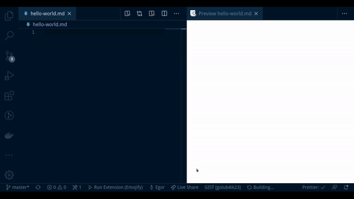

# Emojify

:boom: That extension is used to use emojis as you go, just open it from command line

## :straight_ruler: Installation

Run `ext install emojify` in the command palette.

## :page_facing_up: Usage

Run `Emojify: Start` in the command palette to run the extension, choose the emoji from the list, and you will be provided with options (what to do with that emoji)

## :rocket: Features

:sparkles: Insert emoji on cursor position  
:sparkles: Copy emoji to clipboard  
:sparkles: Get emoji code  
:sparkles: Get commit message with emoji

##### Example of usage

## :dizzy: Why?

I decided to make that small (buggy for sure) extension for the personal usage, but then I decided to share it with community. Maybe you'll like it, maybe not.  
But that was a great experience :fire:

## Release Notes

### 1.0.0

Release of extension
